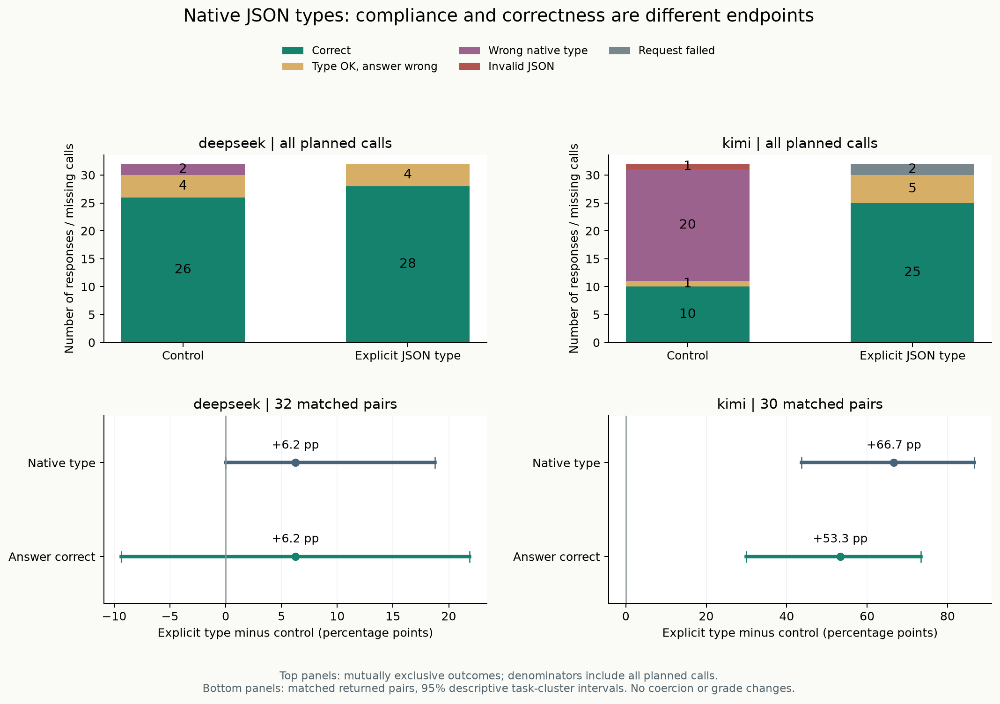
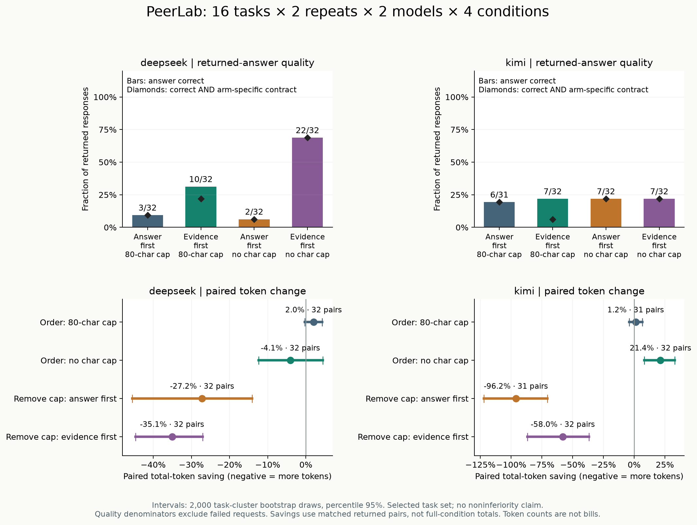

# PeerLab ↗

**两个 AI，能否答得更好，也用得更省？**

一个可以在本地复现的 **DeepSeek × Kimi 实验项目**。研究交叉审稿能否改善答案，以及压缩提示词、减少解释能否在节省 token 的同时保住质量。公开执行前方案、完整输出和可离线重算的结果。

Python 3.10+ · 运行时零第三方依赖 · MIT · 中文题库 · 离线交互报告

## 实验成果一览

**已公开6轮真实实验：948次API请求尝试，939次返回，9次请求失败，已知返回用量286,809 token。** 另有18个互审依赖步骤因前置失败未发起请求。失败记录均保留，不补成漂亮的完整数据。

|研究|本轮题目数|实验重点|请求尝试 / 返回|已知总token|查看成果|
|---|---:|---|---:|---:|---|
|首轮试运行|3|独立、自检、交叉审稿|30 / 30|11,166|[观察与案例](docs/pilot-findings.md)|
|v0.2 审稿研究|12|普通互审 vs 先独立解答再审稿|150 / 145|80,658|[详细结果](docs/studies/review-study-v1-findings.md)|
|v0.3 Token效率|12|提示词长短 × 是否解释|96 / 95|21,451|[详细结果](docs/studies/token-efficiency-v1-findings.md)|
|v0.4 多维度复测|24|每题两次，加入先依据后答案|288 / 288|62,837|[详细结果](docs/studies/token-efficiency-v2-findings.md)|
|v0.5 顺序与限长|16|每题两次，字段顺序 × 80字符限制|256 / 255|72,608|[结果与反例](docs/studies/token-efficiency-v3-findings.md)|
|**v0.6 JSON类型提醒**|**16个新实例**|**同题配对：格式、类型、正确率与用量**|**128 / 126**|**38,089**|[**最新结果与反例**](docs/studies/token-efficiency-v4-findings.md)|

题目在不同轮次间有复用，不能把题目数相加当成独立样本；重复请求也不是新题。token是供应商报告的用量，不是账单金额，失败请求可能已计费。各轮题集与协议不同，下面的数据用于研究提示策略，不用于跨轮成绩排名。

## 最新实验：多写一句类型要求，值得吗？

**16个新实例 × 2次采样 × 2模型 × 2条件 = 128次请求。** 两组都先依据后答案，实验组只增加一句明确要求number/array原生类型的提示。126次返回、2次Kimi网络失败，未重试。题目本身已有类型要求，测的是强化提醒的效果。

|模型|条件|正确 / 返回|返回正确率|类型合格 / 返回|总token|正确 / 计划|
|---|---|---:|---:|---:|---:|---:|
|DeepSeek|控制|26 / 32|81.25%|30 / 32|7,785|26 / 32|
|DeepSeek|明确类型|28 / 32|87.50%|32 / 32|9,085|28 / 32|
|Kimi|控制|10 / 32|31.25%|11 / 32|10,423|10 / 32|
|Kimi|明确类型|25 / 30|83.33%|30 / 30|10,796|25 / 32|

类型合格只说明answer是要求的number或array，**不保证答案正确**。Kimi明确类型组按计划计算的正确交付为25/32（78.13%）；上表83.33%以返回为分母。数值误差门槛仍为1e-6，字符串不自动转型。

### 同题配对：用量增加，换到了什么？

|模型|有效配对|正确次数|改善 / 退步|配对总token变化|每个正确答案token|
|---|---:|---:|---:|---:|---:|
|DeepSeek|32|26 → 28|4 / 2|7,785 → 9,085（+16.7%）|299.42 → 324.46（+8.4%）|
|Kimi|30|9 → 25|16 / 0|9,820 → 10,796（+9.9%）|1,091.11 → 431.84（−60.4%）|

每个正确答案token＝同一批有效配对的总token÷正确次数。**Kimi的−60.4%是这个比值下降，不是每次请求省60.4%，也不是实际账单节省。** 两次失败对应的控制结果在配对分析中一并排除，因此Kimi这里是9/30而非全组10/32。

- **类型错误减少，但计算错误仍在。** 控制组DeepSeek有2条错型、Kimi有20条错型；明确类型组的62条返回均类型合格，仍分别有4条和5条答案错误。
- **同一句提醒对不同模型收益不同。** DeepSeek数值题正确数仍为20/24；数组题6/8→8/8。Kimi数值题4/24→17/22，数组题6/8→8/8；其数值实验组另有2次失败。
- **保留退步与不确定性。** DeepSeek配对正确率差+6.25个百分点，按题聚类95%描述区间为[-9.38, +21.88]；Kimi+53.33，区间[+30.00, +73.33]。16个实例仍属已知题型，每题两次，不支持总体能力或普遍收益结论。



图上半部分以全部计划请求为分母，下半部分仅用双方返回的配对，区间按题聚类。更多数据：[输入/输出token、延迟、重复稳定性与反例](docs/studies/token-efficiency-v4-findings.md) · [用量图](examples/token-efficiency-v4/figures/quality-and-tokens.png) · [题型图](examples/token-efficiency-v4/figures/category-quality.png)。

**复核入口：** [原始数据与离线报告](examples/token-efficiency-v4/README.md) · [执行前方案](docs/studies/token-efficiency-v4.md) · [类型指标解释](docs/native-type-analysis.md) · [观点：把token预算花在可用答案上](docs/opinions/types-and-token-budget.md)。

```bash
# 不需要密钥、不联网：从原始输出重算最新研究
python -m peerlab analyze-efficiency examples/token-efficiency-v4/run.json --output runs/v4-recheck
```

## v0.5：先写答案，还是先写依据？

**16题 × 2次采样 × 2模型 × 4条件 = 256次请求。** 四组保留相同题目和其他提示要求，只改变JSON中answer/evidence顺序，以及依据是否限制80 Unicode字符。255次返回、1次Kimi网络失败，无重试。

|模型|输出顺序|依据上限|正确 / 返回|正确率|总token|符合本条件契约且正确 / 计划|
|---|---|---|---:|---:|---:|---:|
|DeepSeek|先答案|80字符|3 / 32|9.38%|6,381|3 / 32|
|DeepSeek|先依据|80字符|10 / 32|31.25%|6,253|7 / 32|
|DeepSeek|先答案|无明确字符上限|2 / 32|6.25%|8,116|2 / 32|
|**DeepSeek**|**先依据**|**无明确字符上限**|**22 / 32**|**68.75%**|**8,445**|**22 / 32**|
|Kimi|先答案|80字符|6 / 31|19.35%|7,620|6 / 32|
|Kimi|先依据|80字符|7 / 32|21.88%|7,797|2 / 32|
|Kimi|先答案|无明确字符上限|7 / 32|21.88%|15,674|7 / 32|
|Kimi|先依据|无明确字符上限|7 / 32|21.88%|12,322|7 / 32|

**表格怎么读：** 正确率分母是实际返回数，最后一列分母是计划数。本条件契约额外检查字段、依据非空、字段顺序，以及限长组的80字符要求；去掉限制本身就可能提高合格率，因此另提供四组均不检查长度的[共同契约分析](examples/token-efficiency-v3/factorial.md)。无明确字符上限仍要求简短，并受700输出token上限约束。

### 同题配对后，关键差异是什么？

|比较|有效配对|正确次数变化|总token变化|改善 / 退步|
|---|---:|---:|---:|---:|
|DeepSeek，不限长：先答案 → 先依据|32|2 → 22|增加4.1%|20 / 0|
|DeepSeek，先答案：限长 → 不限长|32|3 → 2|增加27.2%|0 / 1|
|Kimi，不限长：先答案 → 先依据|32|7 → 7|减少21.4%|5 / 5|
|Kimi，先答案：限长 → 不限长|31|6 → 6|增加96.2%|1 / 1|

- **顺序的效果与模型、长度要求有关。** DeepSeek这组已知难题中，先依据不限长改善明显；但限长时的代码题也有从对变错的反例，不能视为万能模板。
- **总分相同不等于回答相同。** Kimi不限长两组都是7/32，却有5次改善和5次退步；报告保留每个变化的原始记录。
- **解释变长不保证答案变好。** 两个模型的先答案组去掉限长后都增加用量，却没有净正确次数收益（按有效配对）。一些依据已算对，answer字段仍是错的。
- **格式也会影响可用性。** Kimi先依据限长正确7条，符合全部要求且正确只有2条；超长、数字字符串、截断都有单独诊断。



图中的点与区间来自同模型、同题、同重复的有效配对；正确率条形按返回数计算。区间是按题聚类的描述，不代表总体能力或等价性证明。更多维度：[5类题型](examples/token-efficiency-v3/figures/category-quality.png) · [因素交互图](examples/token-efficiency-v3/figures/factor-interaction.png) · [稳定性、误差、延迟](examples/token-efficiency-v3/dimensions.md)。

**复核入口：** [完整分析与正反案例](docs/studies/token-efficiency-v3-findings.md) · [原始记录与离线HTML](examples/token-efficiency-v3/README.md) · [执行前方案](docs/studies/token-efficiency-v3.md) · [观点：顺序不是装饰，长度也不是质量](docs/opinions/order-length-and-usable-output.md)。

```bash
# 不需要密钥、不联网：重算v0.5顺序与限长研究
python -m peerlab analyze-efficiency examples/token-efficiency-v3/run.json --output runs/v3-recheck
```

## v0.4复测：依据、正确率与输出要求

v0.4使用24题、每题两次、两模型三条件，288次请求全部返回。每组48次响应；这轮题集与提示不同，**不能与v0.5的正确率直接比较高低**。

|模型|条件|正确 / 返回|总token|符合本条件契约且正确 / 计划|
|---|---|---:|---:|---:|
|DeepSeek|常规提示＋解释|13 / 48|10,813|13 / 48|
|DeepSeek|短提示＋仅答案|17 / 48|5,160|17 / 48|
|DeepSeek|短提示＋先依据后答案|40 / 48|8,744|27 / 48|
|Kimi|常规提示＋解释|18 / 48|20,187|18 / 48|
|Kimi|短提示＋仅答案|17 / 48|6,547|17 / 48|
|Kimi|短提示＋先依据后答案|22 / 48|11,386|10 / 48|

先依据后答案相对仅答案，DeepSeek正确数17→40、总token增加69.5%；Kimi17→22、总token增加73.9%。但它同时改变多个提示要求，因此才继续做v0.5拆分因素的实验。依据超过80字符也是“答对”与“符合全部要求”之间差距的重要来源。[详细数据与限制](docs/studies/token-efficiency-v2-findings.md) · [观点：测量可用的答案](docs/opinions/measure-usable-answers.md)。

## 更早的实验发现

|研究|直接观察|不能据此推出|
|---|---|---|
|v0.3 提示压缩＋仅答案|DeepSeek在11个有效配对中节省53.9%总token，正确数3→3；Kimi12个有效配对节省72.3%，正确数3→3|不能因为少花token且总分相同，就认为质量足够或等价|
|v0.2 先独立解答再审稿|普通互审→先解后审，两模型各9个有效配对；DeepSeek正确4→6，Kimi5→5|不能忽略缺失，或推断额外审稿普遍有效|
|3题试运行|DeepSeek独立、自检、互审均2/3；Kimi均3/3，出现Kimi认可错误候选的案例|不能用极小题集排模型名次|

## 实验方法与复现

所有研究保留请求提示、返回模型名、原始响应、判分、token、耗时、截断与失败记录。参考答案不发送给被测模型；不会执行模型生成代码，也不让参赛模型给自己判分。

|协议|研究问题|方法文档|
|---|---|---|
|`token-efficiency-v4`|明确JSON原生类型提醒是否值得额外token|[类型与正确性指南](docs/native-type-analysis.md)|
|`token-efficiency-v3`|字段顺序与依据限长的独立及组合效果|[因素分析指南](docs/factorial-analysis.md)|
|`token-efficiency-v2`|题型、重复、格式、精度、延迟如何改变结论|[多维度指标](docs/multidimensional-analysis.md)|
|`token-efficiency-v1`|提示词压缩与省略解释是否节省token|[2×2效率实验](docs/token-efficiency.md)|
|`independent` / `classic`|独立、自检、交叉审稿及先解后审|[互审协议](docs/independent-review.md)|

```bash
# 离线预览最新类型协议，默认3题一次，共12次请求
python -m peerlab efficiency --protocol token-efficiency-v4 --dry-run
# 查看四条件协议，默认3题一次，共24次请求
python -m peerlab efficiency --protocol token-efficiency-v3 --dry-run
# 查看三条件复测计划，默认3题一次，共18次请求
python -m peerlab efficiency --protocol token-efficiency-v2 --dry-run
```

## 5 分钟开始

下载或克隆仓库，在项目根目录运行。无需安装依赖。

```powershell
# Windows PowerShell
git clone https://github.com/Yhg1123/peerlab-ai.git
cd peerlab-ai
Copy-Item .env.example .env
# 用编辑器把两个 API key 填进 .env
python -m peerlab doctor
python -m peerlab run
```

```bash
# macOS / Linux
git clone https://github.com/Yhg1123/peerlab-ai.git
cd peerlab-ai
cp .env.example .env
# 编辑 .env
python3 -m peerlab doctor
python3 -m peerlab run
```

配置：

```dotenv
DEEPSEEK_API_KEY=your_deepseek_key_here
KIMI_API_KEY=your_kimi_key_here
DEEPSEEK_MODEL=deepseek-flash
KIMI_MODEL=kimi-k2.6
```

环境变量优先于当前目录的 `.env`。`doctor` 查询官方模型列表并核对配置，不发起聊天请求。运行前也会核对模型名；**不自动切换模型**，避免悄悄改变实验条件。

默认关闭思考模式、`temperature=0.6`。请使用支持这些参数的模型；例如不支持关闭推理的模型不能直接替换使用。模型服务可能更新，重跑前检查官方文档和 `doctor` 输出。

每次运行创建独立目录 `runs/<时间戳>/`：

| 文件 | 用途 |
|---|---|
| `run.json` | 数据集快照、配置、逐步提示词与输出、客观判分、用量 |
| `report.html` | 自包含离线报告，响应式布局，匿名 A/B 人工评分 |
| `summary.md` | 可读实验摘要，适合保存到 GitHub |
| `scores.csv` | 逐题最终答案得分，可用于二次分析 |

双击 `report.html` 打开。浏览器不会调用 API，也不会接触密钥。人工评分保存在当前浏览器中，可导出 JSON；受限浏览器可能只保留到页面关闭，请及时导出。报告源数据含身份映射，匿名功能用于减少先入为主，**不是防作弊盲评系统**。

## 控制实验规模

默认只取题库前 3 题，单次采样，最多 30 次聊天请求，每次最多 700 输出 token。请求上限与输出上限不是人民币费用上限：输入也计费，失败或超时请求可能已由供应商计费。项目不保存易过期的价格表，实际费用以供应商后台为准。

```bash
# 完整 12 题，每题一次，共 120 次调用
python -m peerlab run --limit 12 --max-calls 120

# 完整 12 题，每题三次，共 360 次调用
python -m peerlab run --limit 12 --repeats 3 --max-calls 360 --seed 42

# 限制输出、超时，指定新的结果目录
python -m peerlab run --max-tokens 700 --timeout 90 --output runs/my-study

# 完全离线预览第四组方案，不读取API客户端、不消耗余额
python -m peerlab run --protocol independent --limit 3 --max-calls 42 --dry-run

# 离线重新生成报告，不会请求 API
python -m peerlab report examples/pilot/run.json --output runs/rebuilt

# 从原始输出重新核对判分，导出配对比较和用量分析
python -m peerlab analyze examples/pilot/run.json --left baseline --right peer --output runs/pilot-analysis

# 列出题目 / 运行离线测试
python -m peerlab cases
python -m unittest discover -s tests -v
```

不自动重试，不覆盖已有运行目录。中断时已保存的 `run.json` 保留，可离线生成报告；当前请求可能已计费。失败的依赖会导致对应修订跳过。计划调用数超过预算时，在任何网络请求之前退出。

可选安装：`python -m pip install -e .`，随后也可以使用 `peerlab run`。

离线分析会验证题库hash、重算判分、拒绝重复记录，并区分配对缺失和答错；新协议默认比较peer与peer_independent。详见[独立复核方法与成本口径](docs/offline-analysis.md)。

## 题库与判分

新增可复算的数值题库生成器：`python -m peerlab generate --family bayes --count 6 --seed 42 --output runs/bayes.json`。支持 Bayes 与 macro-F1，标准答案使用精确分数计算；`python -m peerlab verify-dataset runs/bayes.json` 可离线校验。详见[生成题库说明](docs/generated-datasets.md)。

12 道自建题涵盖概率推理、代码理解、结构化输出、指令遵循、约束规划、机器学习指标与证据不足时的拒答。**程序不执行模型生成代码**。

模型返回 `{"answer": ..., "explanation": "..."}`。仅最终 `answer` 接受自动评分：数值使用绝对容差，数组和对象严格比较结构、类型与内容；允许完整 JSON 代码块，不从散文中搜索答案。非法 JSON、重复键、截断均记未通过。网络错误与缺失单独计覆盖率，不混成错误答案。

题库格式见 [`peerlab/data/cases.json`](peerlab/data/cases.json)。支持 `--dataset your-cases.json`；字段为 `id`、`category`、`title`、`prompt`、`check`、`expected`、`rationale`，数值题可加 `tolerance`。题目和输出都会发给两个供应商，请只放适合发送的内容。

## 实验能说明什么，不能说明什么

- 可以追踪互审修正了哪些错题、改坏了哪些正确答案，并与自检条件比较。
- Self 与 Peer 的额外调用数相同，但 token、耗时和金额没有被严格匹配。
- `seed` 控制本地顺序和展示；云端模型采样不保证确定性。调用顺序在基线和依赖约束下随机化，不是完全交叉平衡设计。
- 每个修订条件与同一次 baseline 配对。分析提升/退步只使用两边都有回答的有效配对，不能跨不同覆盖率直接比较准确率。
- 题库小、人工选择、可能被模型见过；没有隐藏测试集。重复同一题不是增加独立题目数量。
- 解释可能在最终数值正确时仍出错，所以另设人工评审。不会让参赛模型给自己判分。
- 本项目不自动给出统计显著性结论。正式研究应预先固定题库、采样次数与分析方法，并扩充题目与独立人工评审者。

## 目录

```text
peerlab/
  client.py             官方 API 适配、超时与安全错误信息
  experiment.py         三/四组协议、预算、依赖追踪与配对统计
  datasets.py           精确算术题库生成与参考答案校验
  analysis.py           原始记录核验、同题配对比较与用量分析
  grading.py            不执行代码的严格判分
  report.py             HTML / Markdown / CSV 导出
  data/cases.json       12 题与独立参考答案
  templates/report.html 离线报告与匿名人工评分
examples/pilot/         真实试运行记录
tests/                  不使用真实 API 的自动化测试
scripts/package_release.py  带密钥检查的源码打包
```

## 保存到 GitHub

`.env`、本地 `runs/` 和发布包 `dist/` 已加入 `.gitignore`。不要用 `git add -f .env`。提供的源码打包脚本只收集明确允许的项目目录，并拒绝疑似 API key：

```bash
python scripts/package_release.py
```

产出 `dist/peerlab-ai-source.zip`，可以解压后上传仓库。也可以在自己的空 GitHub 仓库中按页面提示设置 remote，再 `git add .`、提交和推送。此项目没有自动创建远程仓库或上传任何密钥。

若 key 曾出现在聊天、截图或公开记录中，应在各自控制台撤销并重新生成，再更新本地 `.env`。

## 官方接口资料

- [DeepSeek API 快速开始](https://api-docs.deepseek.com/) / [Chat Completions](https://api-docs.deepseek.com/api/create-chat-completion/)
- [Kimi Chat Completions](https://platform.kimi.com/docs/api/chat)

本项目是独立开源实验，与两家供应商没有官方隶属关系。贡献说明见 [CONTRIBUTING.md](CONTRIBUTING.md)，代码按 [MIT](LICENSE) 许可开放。
