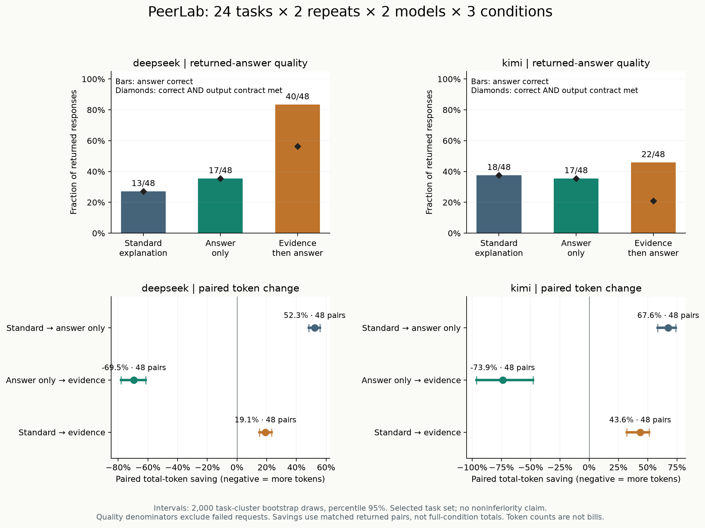
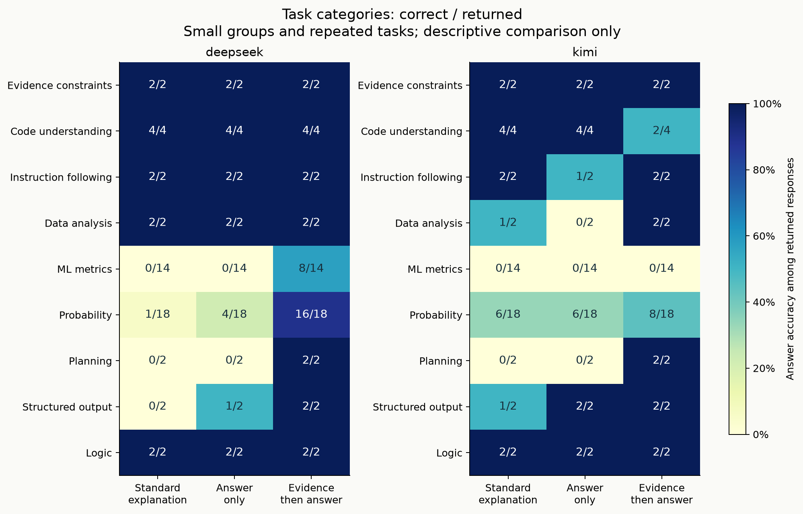

# 288次请求的多维度复测：简短依据改善了部分答案，却未稳定满足输出约束

2026-10-02 · [执行前方案](token-efficiency-v2.md) · [数据与报告](../../examples/token-efficiency-v2/README.md) · [指标解读](../multidimensional-analysis.md)

这轮把题量从12增至24、每题从一次增至两次。新增“先给简短依据，再给答案”的条件，和常规解释、仅答案比较。**仅答案继续节省token；先依据后答案在DeepSeek上明显增加正确回答，在Kimi上有改善也有退步。两者都经常超过预设的80字依据限制。** 因此答案得分提高和完整交付合格必须分开报告。

## 数据是怎样得到的

执行前代码和方案提交于[5d6316e](https://github.com/Yhg1123/peerlab-ai/commit/5d6316e)。北京时间2026-10-02 22:10:37—22:22:11运行，**288次请求全部返回**，没有网络失败、重试或替换样本。调用前落盘记录，最终原始文件按字节保存并公开SHA256。

24题包含12道生成数值题（6道Bayes、6道macro-F1）和原题库全部12题，共9个类别。生成数值参考用有理数程序核验，人工参考题并未伪称程序证明。每题2次、每模型3条件：每个条件48条回答；这是24道不同题目，不是48道，同题型变体之间也可能相关。

两模型分别为deepseek-flash、kimi-k2.6，请求名与返回名一致，temperature=0.6，thinking=disabled，输出上限700token，超时90秒。原始数据记录的程序版本为0.3.0加上述执行commit的新协议；成果随v0.4.0发布，精确代码以commit为准。

288条返回均包含输入/输出/总token和客户端耗时，总用量 **62,837 token**（DeepSeek 24,717，Kimi 38,120）。该总和是研究消耗账目，不是跨模型成本排行榜，也不是人民币账单。

## 1. 先看整体：省多少，答对多少

| 模型 | 条件 | 答案正确/返回 | 正确率 | 总token | JSON合法 | 输出契约合格且正确 |
|---|---|---:|---:|---:|---:|---:|
| DeepSeek | 常规解释 | 13/48 | 27.1% | 10,813 | 46/48 | 13/48 |
| DeepSeek | 仅答案 | 17/48 | 35.4% | 5,160 | 48/48 | 17/48 |
| DeepSeek | 先依据后答案 | 40/48 | 83.3% | 8,744 | 48/48 | **27/48** |
| Kimi | 常规解释 | 18/48 | 37.5% | 20,187 | 35/48 | 18/48 |
| Kimi | 仅答案 | 17/48 | 35.4% | 6,547 | 46/48 | 17/48 |
| Kimi | 先依据后答案 | 22/48 | 45.8% | 11,386 | 48/48 | **10/48** |

“JSON合法”要求输出完整且是一个可解析对象；“输出契约合格”额外检查对应字段、字符串类型，以及evidence先于answer、长度1—80等要求。依据的语义真实性没有自动评分。正式答案分数仍只判answer，未用新增契约规则覆盖旧规则。

### 主比较：常规解释 → 仅答案

全部都是48个同题同重复的有效配对，无缺失：

| 模型 | 总token减少 | 正确数变化 | 改善/退步配对 | 正确率差（百分点） | 按题聚类95%描述区间 |
|---|---:|---:|---:|---:|---:|
| DeepSeek | **52.3%** | 13→17 | 4/0 | +8.3 | 0.0～+18.8 |
| Kimi | **67.6%** | 18→17 | 3/4 | −2.1 | −10.4～+4.2 |

总token节省的相应描述区间为DeepSeek 48.4%～55.8%，Kimi 58.4%～73.9%。它们来自对这24题的2000次聚类重采样，不代表新题总体，也未校正多重比较；正确率差区间覆盖0不能解释为“质量等价”。

这与前轮“仅答案明显减少用量”的方向一致，但本轮题集、重复次数和条件集合不同，**没有把两个研究合并计算改善趋势**。Kimi出现4次退步与3次改善，直接说明不能把省token自动叫作无损。

### 探索比较：先依据后答案

与仅答案比，DeepSeek正确数17→40，23个配对改善、0个退步，总token却**增加69.5%**；Kimi正确数17→22，10个改善、5个退步，总token**增加73.9%**。这个策略不是所有参照下都更省。

若参照常规解释，新策略的总token分别减少19.1%、43.6%，正确数分别13→40、18→22。DeepSeek正确率差为+56.3个百分点，按题聚类描述区间+39.6～+72.9；Kimi为+8.3个百分点，区间−8.3～+27.1。这里描述的是整套提示策略的观察差异，不是“输出顺序”的单因素因果效应。

每个正确答案摊到的总token（包括错误回答的用量）为：DeepSeek常规831.8、仅答案303.5、新条件218.6；Kimi常规1121.5、仅答案385.1、新条件517.5。**Kimi虽然多答对了5次，但这个按正确答案摊用量的指标反而变差。** 该指标仍没有计入解释语义质量或业务质量门槛。

## 2. 题型分层：改善并不均匀

| 模型与题型 | 常规解释 | 仅答案 | 先依据后答案 |
|---|---:|---:|---:|
| DeepSeek：概率推理 | 1/18 | 4/18 | 16/18 |
| DeepSeek：机器学习指标 | 0/14 | 0/14 | 8/14 |
| DeepSeek：代码理解 | 4/4 | 4/4 | 4/4 |
| Kimi：概率推理 | 6/18 | 6/18 | 8/18 |
| Kimi：机器学习指标 | 0/14 | 0/14 | 0/14 |
| Kimi：代码理解 | 4/4 | 4/4 | 2/4 |

分母是响应次数：例如18条概率回答实际来自9题、每题两次。规划类只有1题×2次，两模型新条件均从仅答案0/2变为2/2，只能说明这道题的结果。代码理解只含2题，也不能从2/4推广到所有代码任务。

12道生成题对应24次回答。DeepSeek三条件正确数是1→1→17；Kimi是1→1→6。12道人工参考题对应24次回答，分别12→16→23和17→16→16。新策略在Kimi人工题上总数没有增加，但内部有得有失。类别与参考来源是重叠的两个维度，不能叠加成更多样本。

## 3. 两次回答是否稳定

每个条件都有24道题的完整两次回答，没有因网络缺失剔除题目。

| 模型 | 条件 | 两次都对的题数 | 一对一错的题数 | 两次均可解析的题数 | 答案完全相同的题数 |
|---|---|---:|---:|---:|---:|
| DeepSeek | 常规解释 | 6 | 1 | 23 | 9 |
| DeepSeek | 仅答案 | 7 | 3 | 24 | 8 |
| DeepSeek | 先依据后答案 | **17** | 6 | 24 | 13 |
| Kimi | 常规解释 | 7 | 4 | 14 | 8 |
| Kimi | 仅答案 | 7 | 3 | 22 | 8 |
| Kimi | 先依据后答案 | **9** | 4 | 24 | 12 |

“完全相同”只在两次均可解析时检查，保留值类型、比较规范序列化结果；它不要求答案正确。数值差异在容差内也可能两次均正确，所以“始终正确”和“答案完全相同”不是包含关系。DeepSeek新条件虽然总得分高，仍有6题一次对一次错，不能当作确定性求解器。

## 4. 错误到底是精度，还是类型/任务理解

各条件都有36次数值题响应。下面使用预先规定的诊断阈值；**不替换每题原来的tolerance和正式得分**。非法JSON、截断、数字字符串不因阈值放宽而通过。

| 模型 | 条件 | 有限数值答案/36 | 误差≤1e-6 | ≤1e-4 | ≤1e-2 |
|---|---|---:|---:|---:|---:|
| DeepSeek | 常规解释 | 33 | 3 | 7 | 16 |
| DeepSeek | 仅答案 | 36 | 5 | 11 | 19 |
| DeepSeek | 先依据后答案 | 36 | 24 | 29 | 31 |
| Kimi | 常规解释 | 23 | 5 | 9 | 14 |
| Kimi | 仅答案 | 35 | 5 | 8 | 22 |
| Kimi | 先依据后答案 | 32 | 11 | 21 | 26 |

部分回答确实只是精度不足，但不是所有错误都能用放宽阈值解决。新条件下Kimi有4条完整响应的answer不是有限数值类型；严格程序接口不会把数字字符串当数值。不同数值题的量纲也不同，1e-2不能当成统一可接受业务误差。

## 5. 输出约束的代价

新条件全部96条输出都可解析、字段及顺序合规，但DeepSeek有**19/48**条依据超过80个Unicode码点，Kimi有**37/48**条超长。长度检查按执行前方案包括数字和标点，不是模型token数。这是本轮采用的操作性定义，未事后放宽。

因此新条件的契约合格数为29/48和11/48；同时答案正确只剩27/48和10/48。尤其Kimi，答案分数22/48高于仅答案17/48，但若应用把短依据契约作为硬条件，交付合格且正确数反而低于仅答案。这不是解析器把原始回答“修好”之后的数字，模型输出原样公开。

常规解释中，DeepSeek有2条JSON失败；Kimi有8条JSON失败、5条截断。仅答案中DeepSeek无上述失败，Kimi仍有1条JSON失败、1条截断。新条件无JSON失败或截断。解析器先判是否完整，再判JSON，因此这两类计数互斥。

## 6. 延迟：返回更短确实更快吗

| 模型 | 条件 | 整次请求中位数 | P90 |
|---|---|---:|---:|
| DeepSeek | 常规解释 | 1170ms | 1540ms |
| DeepSeek | 仅答案 | 906ms | 1123ms |
| DeepSeek | 先依据后答案 | 1058ms | 1299ms |
| Kimi | 常规解释 | 4284ms | 14222ms |
| Kimi | 仅答案 | 1127ms | 1234ms |
| Kimi | 先依据后答案 | 3001ms | 4182ms |

本轮观察到仅答案的中位延迟最低，新条件居中。这是客户端完整请求耗时，不是首token速度；使用单机串行调用，供应商负载、缓存和网络未控制，不能据此给模型服务做性能承诺。

## 7. 四个有记录编号的案例

以下是整体结果后的解释性案例，不是额外独立证据或人工修改分数。

- **规划改善且满足长度要求**：DeepSeek critical-path第1次，record 161仅答案给14，record 157先依据后答案给10，并写出A/B/C/D/E起止时间，契约也合格。标准答案是10。
- **数值改善但超长**：DeepSeek v2-generated-macro_f1-003第2次，record 91给0.536842，record 95给0.725461，通过1e-6阈值；后者依据较完整但超过80字，所以答案正确、契约失败。这类记录解释了40/48为何不能写成“40次完全合格交付”。
- **内容看起来对，类型却错**：Kimi python-aliasing两次的新条件（records 35、163）把嵌套数组写进字符串。它描述的元素正确，但answer类型不符合题目；仅答案两次（36、168）均返回真正的数组并通过。不能通过自动去引号悄悄消掉退步。
- **正确依据、精度不足**：Kimi conditional-children第2次，record 129仅答案给0.3333333333333333；record 132依据正确写出1/3，answer却只有0.3333，超过本题1e-5容差。该记录契约合格但答案错误，说明长度/结构检查无法替代数值检查。

## 可支持的判断与下一步

本轮支持“输出策略会同时影响用量、格式、精度和稳定性，需要一起测”的判断。DeepSeek的先依据后答案值得在更多任务上复验；Kimi的类型和长度问题说明不能直接照搬相同策略。

不能从本轮推出：只改字段顺序就导致提升；80字限制已稳定实现；统计上无损；对所有任务有效；总token节省等于费用节省。样本为人为选题，其中含复用题，只有两次采样；多项描述区间也没有多重检验修正。

下一轮可单独检验字段顺序、约束提醒、依据长度三个因素，并预先定义接口合格率目标；这属于**待验证假设**，没有被本轮证明。观点延伸：[从省token到可用答案，需要多把尺子](../opinions/measure-usable-answers.md)。
