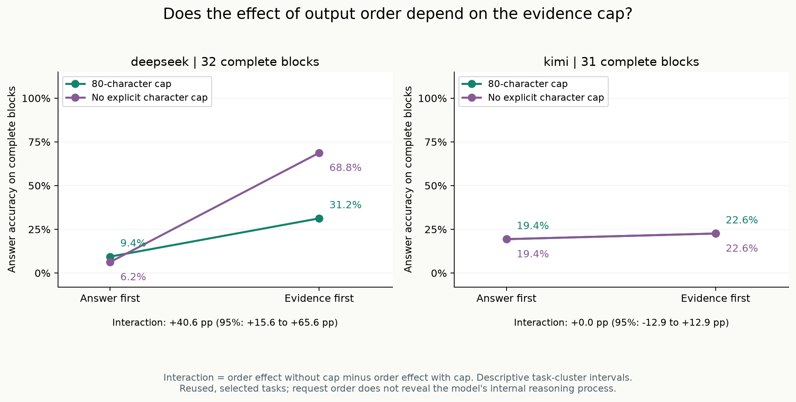
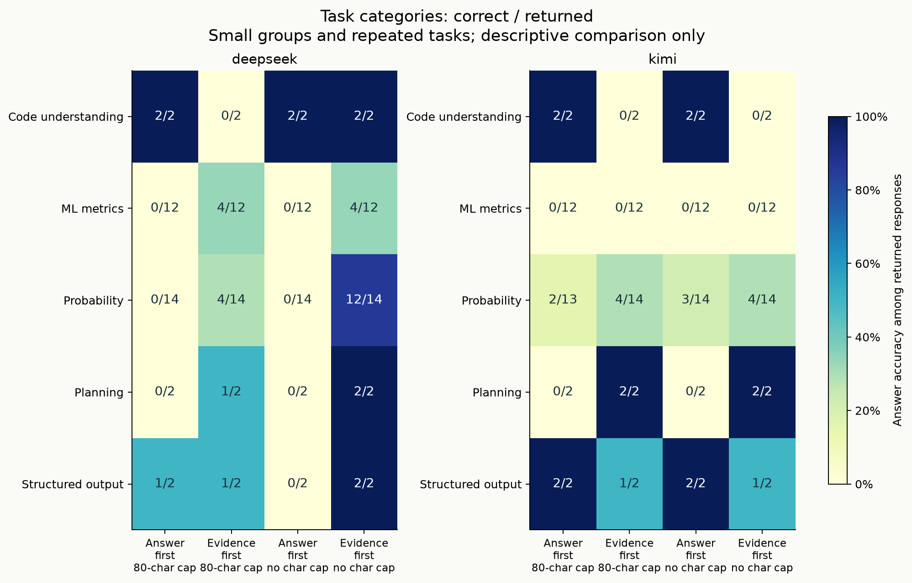

# 答案先写还是后写？256次请求的字段顺序与限长实验

本轮观察到明显的模型与条件差异：无明确字符上限时，DeepSeek从先答案的2/32正确，变为先依据的22/32，总token增加4.1%；Kimi两组都是7/32，但先依据节省21.4%总token，且有5次改善、5次退步。**顺序值得测，但不能把一种输出模板当作普遍有效的技巧。**

这是复用已知难题的小样本探索。没有声明显著性、不劣性或总体能力排名，也没有把原来的错误答案按新规则改判。

## 数据来源与缺失

- 16题：v2的12道程序参考题，另加代码别名、关键路径、结构化排序、无放回抽球四题；5类题型。题目按已知v2现象选择，不是留出集。每题每条件两次，两模型四条件，计划并尝试256次。
- 255次返回，1次Kimi网络失败：`expected-draws`重复2、`answer_first_bounded`，record **#235**。没有重试或替补。运行状态如实为`partial`。
- 返回用量合计 **72,608 token**：输入35,214，输出37,394。255条返回都有三项用量；失败请求费用未知。这些是供应商报告的token，不是账单金额。
- 实际运行UTC：2026-10-02 17:26:19至17:36:54，即北京时间10月3日01:26—01:36。返回模型名分别为`deepseek-flash`和`kimi-k2.6`，均与请求一致。
- [方案](token-efficiency-v3.md)、[机器计划](token-efficiency-v3-plan.json)与程序在请求前上传，commit [`35687e6`](https://github.com/Yhg1123/peerlab-ai/commit/35687e6b83e1107b131de3d4f00c716174623f5c)。[原始记录与SHA256](../../examples/token-efficiency-v3/README.md)可离线复算。

## 四组成绩与实际用量

四组仅改变要求的JSON字段顺序、增删80 Unicode字符限制句；其他系统要求、题目、生成参数相同。“不限长”仍要求简短，并受700输出token上限约束。

|模型|条件|正确/返回/计划|输入token|输出token|总token|共同契约且正确|本条件契约且正确|
|---|---|---:|---:|---:|---:|---:|---:|
|DeepSeek|先答案，限80字符|3/32/32|4518|1863|6381|3|3|
|DeepSeek|先依据，限80字符|10/32/32|4518|1735|6253|10|7|
|DeepSeek|先答案，不限字符|2/32/32|4070|4046|8116|2|2|
|DeepSeek|先依据，不限字符|22/32/32|4070|4375|8445|22|22|
|Kimi|先答案，限80字符|6/31/32|4636|2984|7620|6|6|
|Kimi|先依据，限80字符|7/32/32|4766|3031|7797|7|2|
|Kimi|先答案，不限字符|7/32/32|4318|11356|15674|7|7|
|Kimi|先依据，不限字符|7/32/32|4318|8004|12322|7|7|

共同契约检查仅两个字段、非空字符串依据、该组要求的顺序，四组均不限长度；本条件契约对限长组额外检查≤80字符。两者都与原答案评分相交。删除要求本身就可能提高本条件契约合格数，因此不把7→22或2→7全部解释成格式能力改善。

## 配对结果：净变化之外，还有改善与退步

下表中正确数只来自有效配对；总token节省=1−右侧/左侧，负值表示增加用量。区间是按题ID聚类2000次的95%描述区间，正确率差单位为百分点。

|模型|左→右|配对/缺失|正确数变化|改善/退步|正确率差及区间|总token节省及区间|
|---|---|---:|---:|---:|---|---|
|DeepSeek|限长内，先答案→先依据|32/0|3→10|10/3|+21.9 [0.0,43.8]|+2.0% [-0.3%,4.3%]|
|DeepSeek|不限长内，先答案→先依据|32/0|2→22|20/0|+62.5 [40.6,81.2]|−4.1% [-12.4%,4.5%]|
|DeepSeek|先答案内，限长→不限长|32/0|3→2|0/1|−3.1 [-9.4,0.0]|−27.2% [-45.5%,-14.1%]|
|DeepSeek|先依据内，限长→不限长|32/0|10→22|16/4|+37.5 [12.5,62.5]|−35.1% [-44.7%,-27.0%]|
|Kimi|限长内，先答案→先依据|31/1|6→7|5/4|+3.2 [-20.7,25.0]|+1.2% [-4.1%,6.6%]|
|Kimi|不限长内，先答案→先依据|32/0|7→7|5/5|0.0 [-25.0,21.9]|+21.4% [8.2%,33.0%]|
|Kimi|先答案内，限长→不限长|31/1|6→6|1/1|0.0 [0.0,0.0]|−96.2% [-122.2%,-70.7%]|
|Kimi|先依据内，限长→不限长|32/0|7→7|3/3|0.0 [-12.5,12.5]|−58.0% [-86.7%,-36.8%]|

Kimi有缺失的比较不能直接拿完整条件总量相除：例如限长顺序比较，右侧配对token为7529，不是全组7797。逐对记录ID、输入/输出拆分与精确小数见[analysis.json](../../examples/token-efficiency-v3/analysis.json)。

零宽区间也有值得解释的原因：Kimi先答案的去限长比较中，唯一改善与唯一退步恰好都在`v2-generated-bayes-002`，分别是重复1（#6→#4）和重复2（#90→#96）。两次在同一题簇内抵消；按题重采样时每个簇的净正确率差都是0，故产生[0,0]。**这不证明两个条件等价，更不表示逐次回答完全相同。**

## 交互项：限长改变了顺序干预的表现吗

交互定义为“没有字符上限时的顺序效应，减去有限长时的顺序效应”。只使用同模型/题/重复四组都返回的完整区组。

|模型|完整/缺失区组|正确率交互，百分点|95%描述区间|总token交互，token/区组|95%描述区间|
|---|---:|---:|---|---:|---|
|DeepSeek|32/0|+40.6|[+15.6,+65.6]|+14.3|[-6.4,+31.4]|
|Kimi|31/1|0.0|[-12.9,+12.9]|−108.1|[-171.9,-43.8]|

DeepSeek的顺序差异在不限长组更大，提示应把两个要求一起测试。Kimi没有同样的净正确率交互，但用量组合存在差异。共同契约且正确的交互与答案正确率交互在本轮相同，详见[factorial.json](../../examples/token-efficiency-v3/factorial.json)。

Kimi交互项不是上表0.0−3.2个百分点：交互统一排除了缺一组的抽球重复2；在剩余31个区组中，不限长两组正确数也是6→7，与限长的6→7一致。图使用这个相同的完整区组口径。

## 格式与类型错误会吞掉收益

限长时，DeepSeek先答案有27/32条依据≤80字符，先依据25/32；Kimi分别17/31、12/32。所有这些组的返回都可解析且遵守字段顺序，但不少违反长度限制。先依据限长组中，DeepSeek正确10条而契约合格且正确只有7条；Kimi正确7条，契约合格且正确只有2条。

不限长并不等于更可靠的输出。Kimi先答案不限长有5条非法JSON、3条截断，共8/32条无法作为完整合法回答评分；先依据不限长有1条截断。DeepSeek四组没有JSON失败或截断。非法JSON与截断在当前判分理由中是分开的失败类别，不重复相加同一条。

对返回的数值题做额外类型清点（这是结果后的故障解释，不改预定评分）：Kimi先依据限长的28条数值题中，有14条把answer写成字符串；不限长对应17/28条，另有1条截断。答案看起来像数字，不等于接口返回了数字。不能事后自动转型再把结果称作原协议成绩。

## 题型、稳定性、误差与延迟

DeepSeek不限长时的顺序改善主要在概率题（0/14→12/14），另有macro-F1（0/12→4/12）、规划（0/2→2/2）、结构化输出（0/2→2/2）。代码理解都是2/2。但有限长时，代码理解反而从2/2降到0/2。Kimi的macro-F1四条件都是0/12；先依据的代码理解均0/2，先答案均2/2。各组很小，不应据这些切片建立题型排行榜。

重复稳定性也没有被总分替代：DeepSeek先依据不限长有9/16题两次都正确，4/16题一次对一次错；先依据限长仅1/16题两次都正确，8/16题对错变化。Kimi先答案限长只有15道题两次均返回，其稳定性分母是15，不能与16混用。

精度诊断沿用固定阈值，不修改原题容差。DeepSeek先依据不限长28条数值题中，误差≤1e-6有17条，≤1e-4有19条，≤1e-2有27条；限长对应9、16、22条。这反映部分差异涉及数值精度，但宽阈值不能替代严格答案评分；非法类型或截断也不会因放宽误差而过关。

返回请求的延迟中位数：DeepSeek四组依次976、1017、1129、1185毫秒；Kimi依次1885、2140、5376、3342毫秒（表格顺序）。全量P90和覆盖数见[dimensions.md](../../examples/token-efficiency-v3/dimensions.md)。失败请求不在延迟分布中，网络、服务负载和缓存未控制，因此不能解释为纯模型速度。

## 原始记录中的正反例

以下例子按结果后人工挑选，只解释现象，不代替上面的全体统计。record ID属于本轮run.json，HTML可按题展开查看完整原文。

1. **依据正确，answer仍错。** DeepSeek关键路径重复1，先答案限长#241的依据已经写到E在7—10完成，却输出`answer:15`；先依据限长#248输出10并通过。不限长重复2中，#216的依据同样得出10，answer却是14。Kimi #209也出现依据写10、answer为13，配对先依据#210为10。此处观察到字段间不一致；不能据此宣称读到了模型内部推理。
2. **改善也涉及实际算术。** DeepSeek Bayes重复1，先答案不限长#2输出0.033552，配对先依据#1输出0.033564而通过。macro-F1重复2的#201→#205从0.427350…变为0.537001。两者均使用原程序参考和原容差。
3. **把依据提前也会改坏。** DeepSeek代码别名重复1，先答案限长#195正确返回`[[1,2],[1,2],[3]]`，先依据限长#197返回`[[1],[1,2],[3]]`，漏掉共享列表的后续变化。这是限长顺序比较的3次退步之一。
4. **含义接近，类型错误。** Kimi代码别名#199的answer为字符串`"[[1,2],[1,2],[3]]"`，不是题目要求的数组，因此判错。不能为了提高分数改为提取或执行其中内容。
5. **解释变长也会失败。** Kimi抽球#234在700输出token限制处截断；DeepSeek同题#238完整输出了错误的5.16666…；正确公式出现在其他响应里也不改变这两条成绩。网络失败#235同样保留，未用额外请求修补。

## 这轮支持的观点与下一步

本轮支持把字段顺序和依据预算当成需要配对评估的工程参数。它不支持“解释越长越好”：DeepSeek先答案去掉限长，token增加27.2%而正确数3→2；Kimi两个顺序下去掉限长都明显增加用量，却没有净正确数收益（按有效配对）。同样不能把“先依据”写成万能规则，因为代码题有退步、数值类型错误仍然存在。

下一步可检验更明确的answer类型约束是否减少Kimi字符串数字，以及固定总token预算时的质量变化；需要在新的留出题集上预先冻结方案。当前尚未执行这些实验。单个案例的解释一致性值得研究，但这里没有人工逐条标注的语义一致性总分。

完整局限：选题受v2结果影响、参数题相关、每题仅两次、服务版本与缓存不固定、一个网络缺失、多个比较未校正、解释语义未全面评审。v2和v3提示措辞及题集不同，不把两轮总分拼成能力增长趋势。更短或更便宜的响应也不自动满足真实业务的质量门槛。
